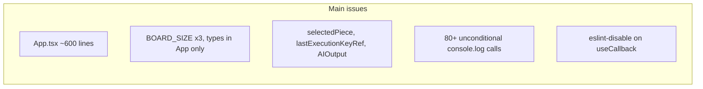
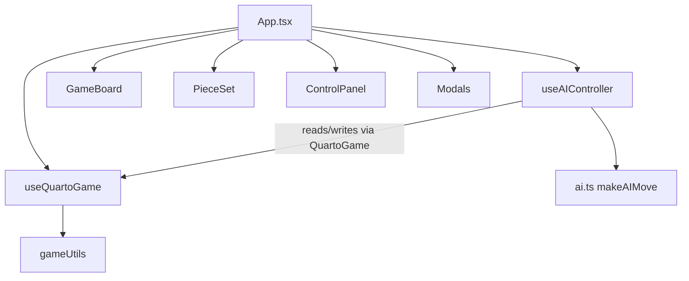

# Code Quality Refactor Plan (No Behavior Change)

## Overview

Refactor QuAIto for maintainability and regression safety without changing game behavior. Focus on decomposing App.tsx, centralizing shared types/constants, cleaning dead code, and adding Vitest coverage for pure logic. MCTS files are left untouched.

## Goals

- Same gameplay, AI decisions, UI, and timing as today
- Smaller, focused modules with shared types/constants
- Remove dead code that adds noise but does nothing
- Vitest tests lock in behavior before and during structural moves
- **Out of scope:** [`src/ai/mcts.ts`](src/ai/mcts.ts), [`src/ai/mctsPlayer.ts`](src/ai/mctsPlayer.ts)

## Task Checklist

Work in this order — dead-code cleanup before hook extraction so dead state is not moved into new hooks:

- [ ] **foundation** — Add `src/types/game.ts` and `src/constants/game.ts`; migrate imports; add `createEmptyBoard`/`getOpponent` helpers; deduplicate win-line scanning in `gameUtils.ts`
- [ ] **vitest** — Add Vitest config (with path aliases) and tests for `gameUtils.ts` and `ai.ts` (deterministic cases with controlled randomness)
- [ ] **ai-logger** — Clean `ai.ts` (hoist `getMinSafePieces`, remove `AIOutput`, use constants) and add `utils/logger.ts`; gate all App debug logs behind `enableAILogging`
- [ ] **dead-code** — Remove `selectedPiece` state, `lastExecutionKeyRef`, duplicate `formatPieceForDisplay`; simplify `PieceSet`; remove unused `.mcts-config` CSS
- [ ] **decompose-app** — Extract `useQuartoGame` and `useAIController` hooks plus modal components; slim `App.tsx`; fix `useCallback` deps (see hook contract below)
- [ ] **verify** — Run `npm test`, `npm run build`, and manual smoke-test all game modes and modals

## Current Pain Points



| Issue | Location | Impact |
|-------|----------|--------|
| God component | [`src/App.tsx`](src/App.tsx) | Hard to change rules, AI wiring, or UI independently |
| Duplicated constants | `App.tsx`, [`GameBoard.tsx`](src/components/GameBoard.tsx), [`ai.ts`](src/ai.ts) | Drift risk if board size ever changes |
| Types live in UI layer | `GamePhase`, `Player` in App; `PieceAttributes` in [`Piece.tsx`](src/components/Piece.tsx) imported by [`gameUtils.ts`](src/utils/gameUtils.ts) | Utils depend on a React component file |
| Dead state/refs | `selectedPiece` never set (only cleared); `lastExecutionKeyRef` never read | Misleading code paths |
| Unused export | `AIOutput` in [`ai.ts`](src/ai.ts) | Noise |
| Logging | Always-on logs in App; gated logs only in ai.ts | Inconsistent debug story |
| Hook deps suppressed | `eslint-disable-next-line react-hooks/exhaustive-deps` on `executeAIMove` | Potential stale-closure risk during refactors |

---

## Phase 1: Shared Foundation (low risk, do first)

Create two small modules and migrate imports (excluding MCTS files):

**[`src/types/game.ts`](src/types/game.ts)** — canonical domain types:

- `PieceAttributes` (moved from [`Piece.tsx`](src/components/Piece.tsx))
- `Player`, `GamePhase`, `GameState`, `AIDifficulty` (`'easy' | 'normal' | 'hard' | 'brutal'`), `Board` (alias for `(PieceAttributes | null)[][]`)
- Re-export from `Piece.tsx` for backward-compatible imports if desired: `export type { PieceAttributes } from '../types/game'`

**[`src/constants/game.ts`](src/constants/game.ts)** — single source:

- `BOARD_SIZE`, `TOTAL_PIECES`, `INITIAL_PLAYER`, `AI_THINKING_DELAY_MS`

**[`src/utils/gameUtils.ts`](src/utils/gameUtils.ts)** additions:

- `createEmptyBoard()` — replaces repeated `Array(BOARD_SIZE).fill(null)...` in App
- `getOpponent(player: Player): Player` — replaces 6 inline ternaries in App
- Replace magic `4` loops with `BOARD_SIZE` from constants
- **Deduplicate win-line scanning** — extract `checkLine(pieces)` helper used by `checkWinCondition` and `getWinningLine`; same outputs, less duplication, simpler tests

Update imports in: `App.tsx`, `GameBoard.tsx`, `ControlPanel.tsx`, `ai.ts`, `gameUtils.ts`, all components.

---

## Phase 2: Vitest Test Suite (regression safety net)

Add Vitest + minimal config (standard Vite project setup):

```bash
npm install -D vitest
```

Add `"test": "vitest"` script and [`vitest.config.ts`](vitest.config.ts) mirroring Vite resolve aliases — include the `@smart-games/common-spa` path from [`tsconfig.app.json`](tsconfig.app.json):

```ts
resolve: {
  alias: {
    '@smart-games/common-spa': path.resolve(__dirname, './shared/common-spa/src/index.ts'),
  },
},
```

**Test files to add:**

| File | What to cover |
|------|----------------|
| [`src/utils/gameUtils.test.ts`](src/utils/gameUtils.test.ts) | `generateAllPieces` (16 unique), `arePiecesEqual`, `checkWinCondition` (row/col/diag wins, no false positives), `getWinningLine` (coordinates match `checkWinCondition` for the same board), `isBoardFull`, `createEmptyBoard` |
| [`src/ai.test.ts`](src/ai.test.ts) | Deterministic cases with controlled randomness (see below) |

**AI test randomness strategy**

`makeAIMove` calls `Math.random` in several places (win-check skip, random placement, random piece, `getRandomElement`). A single mock return value is not enough.

Preferred approaches (pick one or combine):

1. **Test lower-level exports** — call `makeAIPlacement` / `makeAIPieceSelection` (or export them for testing) with fixed boards and `enableLogging: false`, avoiding multi-call random paths where possible.
2. **Sequential `Math.random` mocks** — `vi.spyOn(Math, 'random').mockReturnValueOnce(0).mockReturnValueOnce(0.99)...` in call order for integration-style `makeAIMove` tests.
3. **Force deterministic paths** — use `brutal` difficulty (0% random, 0% win-check skip) plus boards constructed so only one legal move exists.

**Required AI test cases:**

- Winning placement is taken when available
- Safe piece preferred over dangerous piece when giving
- **Winning placement returns `pieceToGive: null`** (game ends; no piece given after a win)

Run tests after every subsequent phase. No snapshot tests on CSS.

---

## Phase 3: Decompose App.tsx

Split without changing state flow or timing. Define the hook contract **before** moving code.

### Hook contract

AI logic reads and mutates the same state as human handlers. Compose hooks in `App.tsx` with an explicit typed interface:

```ts
// App.tsx — composition only
const game = useQuartoGame();
const ai = useAIController(game);
```

**[`useQuartoGame`](src/hooks/useQuartoGame.ts)** returns game state, setters, and human handlers:

```ts
interface QuartoGame {
  // state
  board: Board;
  availablePieces: PieceAttributes[];
  stagedPiece: PieceAttributes | null;
  currentPlayer: Player;
  gamePhase: GamePhase;
  gameState: GameState;
  winner: Player | null;
  winningLine: [number, number][] | null;
  lastMove: [number, number] | null;
  // setters (needed by AI hook)
  setBoard: React.Dispatch<React.SetStateAction<Board>>;
  setAvailablePieces: React.Dispatch<React.SetStateAction<PieceAttributes[]>>;
  setStagedPiece: React.Dispatch<React.SetStateAction<PieceAttributes | null>>;
  setCurrentPlayer: React.Dispatch<React.SetStateAction<Player>>;
  setGamePhase: React.Dispatch<React.SetStateAction<GamePhase>>;
  setLastMove: React.Dispatch<React.SetStateAction<[number, number] | null>>;
  // handlers
  handlePieceSelect: (piece: PieceAttributes) => void;
  handleCellClick: (row: number, col: number) => void;
  startNewGame: () => void;
  getGameStatusMessage: () => string;
  resetAIExecutionRefs: () => void; // clears pendingExecutionRef + executionCountRef
}
```

**[`useAIController`](src/hooks/useAIController.ts)** accepts `QuartoGame` and returns AI settings + execution:

```ts
function useAIController(game: QuartoGame): {
  player1AI: boolean;
  setPlayer1AI: ...;
  player2AI: boolean;
  setPlayer2AI: ...;
  basicAIDifficulty: AIDifficulty;
  setBasicAIDifficulty: ...;
  enableAILogging: boolean;
  setEnableAILogging: ...;
}
```

`useAIController` reads `game.board`, `game.stagedPiece`, etc. and calls `game.setBoard`, `game.setAvailablePieces`, etc. It does **not** duplicate game state.

**`startNewGame` coupling:** `useQuartoGame.startNewGame` must call `game.resetAIExecutionRefs()` (implemented in `useAIController` and passed in, or invoked via a callback ref) so AI pending timers/refs reset with the board — same behavior as today.

### Fixing `useCallback` / stale closures

Functional `setState` alone is not enough: `executeBasicAIMove` also closes over `board`, `stagedPiece`, `enableAILogging`, and `basicAIDifficulty`.

Apply all of the following:

1. Use functional updates where state derives from prior state (`setAvailablePieces(prev => prev.filter(...))`, etc.).
2. Include all genuinely needed values in `executeAIMove` dependency array (`board`, `basicAIDifficulty`, `enableAILogging`, …).
3. If stable callback identity is still needed for the AI `useEffect`, use **refs** for `basicAIDifficulty` and `enableAILogging` (updated each render) while keeping board/stagedPiece in deps or refs consistently.

Goal: remove the `eslint-disable-next-line react-hooks/exhaustive-deps` without changing AI timing or move selection.

### Hook contents

**[`src/hooks/useQuartoGame.ts`](src/hooks/useQuartoGame.ts)** — game state + human interactions:

- State: `board`, `availablePieces`, `stagedPiece`, `currentPlayer`, `gamePhase`, `gameState`, `winner`, `winningLine`, `lastMove`
- Handlers: `handlePieceSelect`, `handleCellClick`, `startNewGame`, `getGameStatusMessage`
- Win/tie `useEffect` (same deps as today)

**[`src/hooks/useAIController.ts`](src/hooks/useAIController.ts)** — AI settings + execution:

- State: `player1AI`, `player2AI`, `basicAIDifficulty`, `enableAILogging`
- Refs: `pendingExecutionRef`, `executionCountRef` (drop `lastExecutionKeyRef`)
- Functions: `executeAIMove`, `applyAIMove`, `applyAIMovePart2`, AI `useEffect` with same 700ms delay

**Modal components** (pure presentational extraction from App JSX):

- [`src/components/modals/ModalShell.tsx`](src/components/modals/ModalShell.tsx) — shared overlay + header + close button (Rules/About/AI modals repeat this pattern)
- [`src/components/modals/AIConfigModal.tsx`](src/components/modals/AIConfigModal.tsx)
- [`src/components/modals/RulesModal.tsx`](src/components/modals/RulesModal.tsx)
- [`src/components/modals/AboutModal.tsx`](src/components/modals/AboutModal.tsx)

**[`src/App.tsx`](src/App.tsx)** after refactor — ~80–120 lines: compose hooks, render grid layout, wire modal open/close booleans.



---

## Phase 4: Clean ai.ts and logging

**[`src/ai.ts`](src/ai.ts):**

- Import `BOARD_SIZE` from constants; use `AIDifficulty` from `types/game.ts`
- Hoist inline `getMinSafePieces` to module level alongside existing `getRandomChance`
- Remove unused `AIOutput` interface
- Keep all difficulty constants and algorithm logic identical

**[`src/utils/logger.ts`](src/utils/logger.ts)** — thin wrapper:

```ts
export function debugLog(enabled: boolean, ...args: unknown[]) {
  if (enabled) console.log(...args);
}
```

- Replace `if (enableLogging) console.log(...)` blocks in `ai.ts` with `debugLog`
- Gate **all** App-side debug logs (AI trace **and** human `handleCellClick` / `handlePieceSelect` logs) behind `enableAILogging` — same flag already exposed in AI Settings modal; removes unconditional console noise without changing visible UI

---

## Phase 5: Component and CSS cleanup

**[`src/components/PieceSet.tsx`](src/components/PieceSet.tsx):**

- Use `arePiecesEqual` instead of manual 4-field comparison
- Remove `selectedPiece` prop and `isPieceSelected` — state is always `null` today, so selection highlight never worked; removing it preserves current visible behavior

**[`src/App.tsx`](src/App.tsx)** (or `useQuartoGame` after decomposition):

- Remove `selectedPiece` state and related `setSelectedPiece` calls

**[`src/App.css`](src/App.css):**

- Remove unused `.mcts-config` block (lines ~454–460) — no JSX references it; MCTS source files stay untouched

**Minor consistency:**

- Deduplicate `formatPieceForDisplay` (defined twice in App AI helpers) — use `formatPieceForLogging` from gameUtils directly

---

## Phase 6: Verification checklist

After all phases, manually smoke-test (unchanged UX):

1. New game: Player 1 AI gives piece, human places
2. Human vs human: give → place → give cycle, win detection, tie on full board
3. AI vs AI at each difficulty — moves still occur with ~700ms delays
4. Enable AI Logging — console output still appears when checked (AI + human action traces)
5. Modals: Rules, About, AI Settings open/close correctly
6. `npm run build` and `npm test` pass

---

## Suggested Implementation Order

Work in this sequence so tests guard each step:

1. Phase 1 (constants/types + win-line dedup) + Phase 2 (tests)
2. Phase 4 (ai.ts cleanup + logger) — easy to test
3. Phase 5 (dead code + PieceSet) — **before** hook extraction; do not move dead state into new hooks
4. Phase 3 (App decomposition) — largest change; rely on tests + manual smoke-test last

## Files touched (summary)

| Action | Files |
|--------|-------|
| New | `types/game.ts`, `constants/game.ts`, `utils/logger.ts`, `hooks/useQuartoGame.ts`, `hooks/useAIController.ts`, `components/modals/*`, `*.test.ts`, `vitest.config.ts` |
| Refactor | `App.tsx`, `ai.ts`, `gameUtils.ts`, `Piece.tsx`, `PieceSet.tsx`, `GameBoard.tsx`, `ControlPanel.tsx` |
| Cleanup only | `App.css` (remove `.mcts-config`) |
| Untouched | `mcts.ts`, `mctsPlayer.ts`, all MCTS imports/logic |
